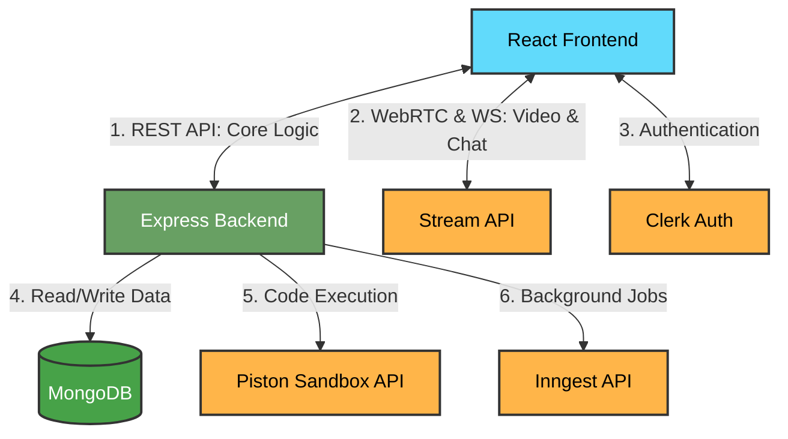

```mermaid
graph TD
    Client[React Frontend] <-->|1. REST API: Core Logic| Server[Express Backend]
    Client <-->|2. WebRTC & WS: Video & Chat| Stream[Stream API]
    Client <-->|3. Authentication| Clerk[Clerk Auth]

    Server -->|4. Read/Write Data| DB[(MongoDB)]
    Server -->|5. Code Execution| Piston[Piston Sandbox API]
    Server -->|6. Background Jobs| Inngest[Inngest API]

    classDef frontend fill:#61dafb,stroke:#333,stroke-width:2px,color:#000;
    classDef backend fill:#68a063,stroke:#333,stroke-width:2px,color:#fff;
    classDef db fill:#47A248,stroke:#333,stroke-width:2px,color:#fff;
    classDef thirdparty fill:#ffb549,stroke:#333,stroke-width:2px,color:#000;

    class Client frontend;
    class Server backend;
    class DB db;
    class Stream,Clerk,Piston,Inngest thirdparty;
```
