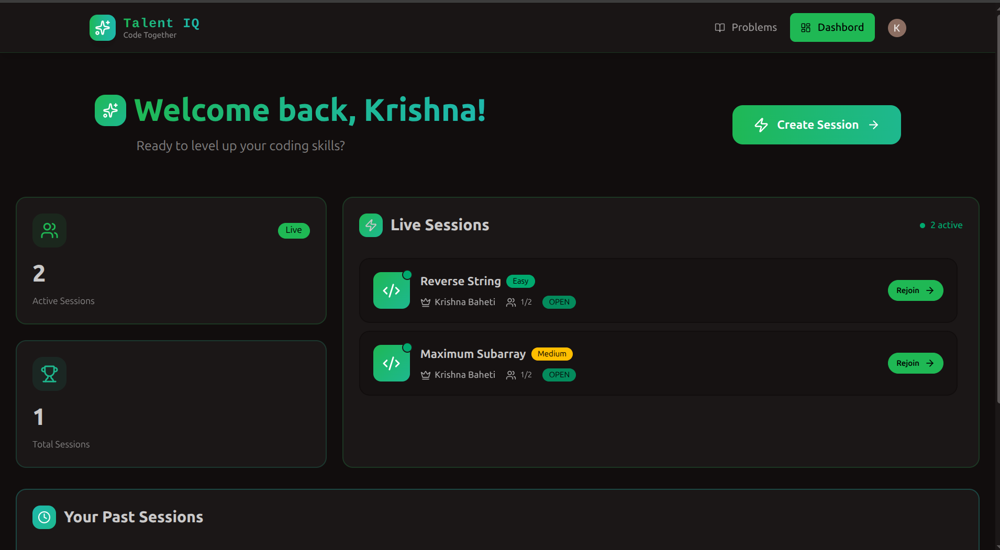
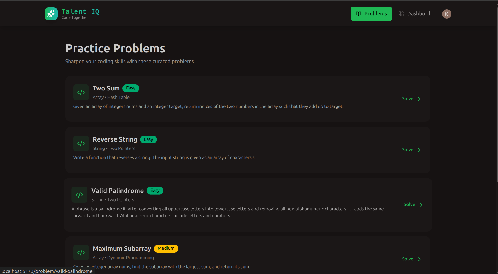
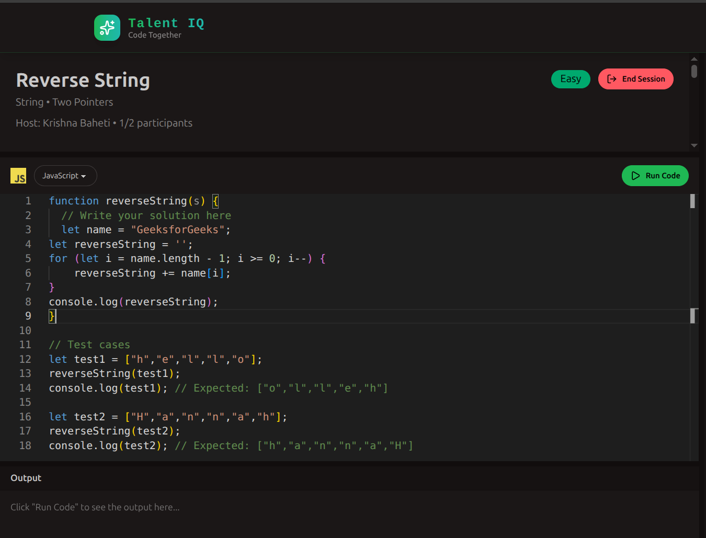
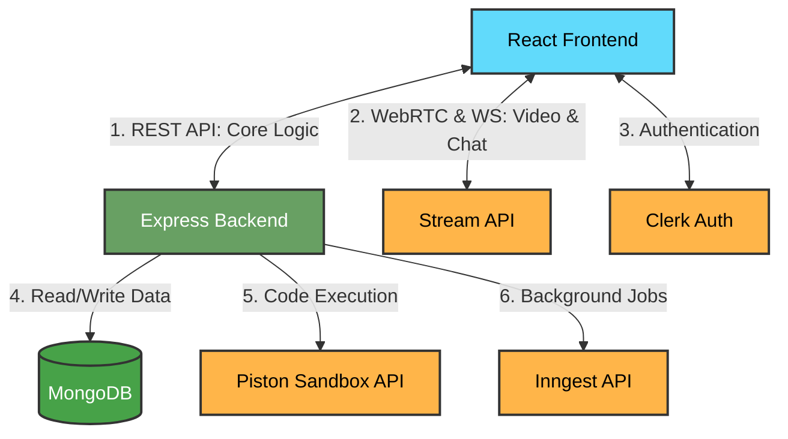

# Talent IQ - Live Coding Interview Platform

A high-performance, full-stack interview platform built to facilitate seamless technical assessments. It provides an immersive live coding environment, integrating real-time video calls, integrated chats, synchronized code collaboration, and secure sandbox code execution to simulate a real-world developer environment.

This app allows users to:

- Sign up and log in securely using Clerk authentication.
- Conduct live technical interviews with real-time video, audio, and screen sharing.
- Collaborate on code in real-time with an integrated editor.
- Execute code instantly in a secure Piston sandbox environment.
- Practice curated Data Structures and Algorithms (DSA) problems.

---

## 📸 Frontend Screenshots

The `images/` folder contains screenshots of the application interface.

### Dashboard



A clean, personalized welcome dashboard where users can view active live sessions, track total sessions, and quickly create new interview rooms or rejoin ongoing ones.

### Practice Problems



A dedicated section featuring a curated list of algorithmic challenges (e.g., Two Sum, Reverse String) with difficulty tags, allowing candidates to sharpen their coding skills.

### Interactive Code Editor



A robust code editing interface supporting multiple languages (like JavaScript). It features syntax highlighting and a built-in terminal console to run code and view output against test cases instantly.

### Live Interview Session


The comprehensive interview environment. It seamlessly combines the synchronized code editor, live video/audio feeds, screen sharing capabilities, and a real-time text chat to ensure smooth communication between the host and participants.

---

## 🏗️ Architecture Flowchart



## 🚀 Tech Stack

- **Frontend:** React.js, Vite
- **Backend:** Node.js, Express.js
- **Database:** MongoDB, Mongoose
- **Authentication:** Clerk
- **Real-Time Video & Chat:** Stream API
- **Code Execution Engine:** Piston Sandbox API
- **Background Jobs & Workflows:** Inngest

## ✨ Key Features

- **Live Video & Screen Sharing:** High-quality, low-latency video and audio communication powered by Stream, allowing interviewers and candidates to interact naturally.
- **Synchronized Code Editor:** Real-time collaborative coding environment where multiple participants can write and edit code simultaneously.
- **Secure Sandbox Execution:** Integrated Piston API to safely execute user-submitted code in isolated environments and return output/errors instantly.
- **Background Task Management:** Leverages Inngest to reliably handle asynchronous events, background jobs, and system workflows without blocking the main event loop.
- **Robust Authentication:** Secure, modern user management and authentication handled entirely by Clerk.
- **Curated Problem Set:** Built-in library of practice problems with expected inputs and outputs to test candidate logic.

## 🗄️ Database Schema Outline

- **User Profile Model:** Synchronizes with Clerk to store application-specific user data, preferences, and session history.
- **Session Model:** Manages interview rooms, linking host IDs, participant IDs, active Stream call references, and associated problem sets.
- **Problem Model:** Stores algorithmic challenges, including descriptions, difficulty levels, boilerplate code, and test cases.

## 🛠️ Installation & Setup

1. **Clone the repository:**

   ```bash
   git clone https://github.com/Krishna-Baheti-27/codepanel.git
   cd codepanel
   ```

2. **Install dependencies for both client and server:**

   ```bash
   npm install
   cd client && npm install
   ```

3. **Set up environment variables:**
   Create a .env file in the frontend (client) directory:

   ```env
    VITE_CLERK_PUBLISHABLE_KEY=your_clerk_publishable_key
    VITE_API_URL=http://localhost:3000/api
    VITE_STREAM_API_KEY=your_stream_api_key
   ```

   Create a .env file in the backend (root) directory

   ```env
    PORT=3000
    DB_URL=your_mongodb_connection_string
    NODE_ENV=development
    CLIENT_URL=http://localhost:5173

    # Clerk Auth
    CLERK_PUBLISHABLE_KEY=your_clerk_publishable_key
    CLERK_SECRET_KEY=your_clerk_secret_key

    # Stream API
    STREAM_API_KEY=your_stream_api_key
    STREAM_API_SECRET=your_stream_api_secret

    # Inngest
    INNGEST_EVENT_KEY=your_inngest_event_key
    INNGEST_SIGNING_KEY=your_inngest_signing_key
   ```

4. **Run the application:**

   ```bash
   # Run backend
   npm run server

   # Run frontend (in a new terminal)
   cd client
   npm run start
   ```

## 👨‍💻 Author

**Krishna**
